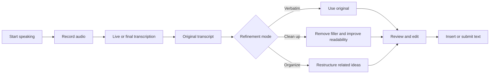

# Voice Input Feature Requirements

**Status:** Draft  
**Last updated:** August 12, 2026  
**Feature names:** Voice Input, Push-to-Talk, Click-to-Talk, Voice Dictation

## 1. Executive summary

Voice Input allows a user to dictate text through a device microphone instead of typing. The application records speech, converts it into a faithful transcript, and makes that text available to the application's normal input workflow.

The recommended design treats voice input as two related but separate capabilities:

1. **Voice capture and transcription** convert speech into a faithful original transcript.
2. **Optional AI refinement** cleans or organizes the transcript for readability.

The application should always preserve the original transcript. AI should never silently replace what the user said. A user must be able to review, edit, undo, or switch between the original and refined versions before the text is submitted or used to trigger an action.

The recommended default is **Clean up**, with **Verbatim** always available and **Organize** offered as an explicit, higher-transformation option.

## 2. Goals

The feature should:

- Make text entry faster and more natural, especially for longer or more complex thoughts.
- Produce an editable, usable transcript with minimal delay.
- Clearly communicate when the microphone is active.
- Give users control over how much AI changes their words.
- Preserve the speaker's meaning, facts, uncertainty, and intent.
- Protect sensitive audio and transcript data.
- Work across supported devices, browsers, and accessibility tools.
- Fail gracefully without losing usable text.

## 3. Non-goals

Unless separately approved, the initial feature is not intended to:

- Record meetings or other people without appropriate consent.
- Replace a dedicated audio-recording or audio-archiving system.
- Automatically submit forms, send messages, or execute commands without review.
- Treat an AI-refined transcript as a legally exact record of speech.
- Infer facts or conclusions the speaker did not provide.
- Identify or authenticate a person by their voice.

## 4. Feature description

Voice Input enables a user to speak through a microphone and insert the resulting text into a selected field. It should support:

- **Push-to-talk:** Recording continues while the user holds a button or keyboard key and stops when it is released.
- **Click-to-talk:** The user clicks once to start recording and again to stop.
- Optional automatic stopping after sustained silence.
- Live transcription when technically practical.
- Review and editing before submission.
- Optional AI-assisted cleanup or organization.
- Cancellation and retry at any stage.

## 5. Recommended user flow

A typical interaction should work as follows:

1. The user presses or clicks the microphone control.
2. The application clearly indicates that recording is active.
3. Speech appears as a live transcript when streaming transcription is available.
4. The user stops or cancels the recording.
5. The application finalizes the original transcript.
6. If refinement is enabled, the application creates a refined version.
7. The user reviews or edits the result.
8. The user inserts, accepts, or submits the text.

## 6. Recording controls and states

### 6.1 Required controls

The interface should include:

- A clearly labeled microphone button.
- A visible recording state, such as an animation, color change, timer, and `Listening...` label.
- A stop control.
- A cancel control that discards the current recording after confirmation when appropriate.
- A processing state while transcription is completing.
- An easy way to retry.
- Keyboard-accessible controls.
- A warning before navigating away during an active recording.

### 6.2 Recommended interactions

- Press and hold the microphone button for push-to-talk.
- Click the microphone button to toggle recording.
- Press `Escape` to cancel.
- Provide an optional keyboard shortcut while the input area is focused.
- Avoid a system-wide shortcut unless the user explicitly enables it.
- Prevent double-clicks or repeated start commands from creating overlapping sessions.

### 6.3 Required application states

The interface should distinguish between:

- Ready
- Requesting microphone permission
- Listening
- Paused, if pausing is supported
- Finalizing transcription
- Refining with AI
- Ready for review
- Cancelled
- Failed, with a recoverable error message

The user should never have to guess whether the microphone is active.

## 7. Microphone permissions and device handling

The application must:

- Request microphone access only after the user initiates voice input.
- Explain why access is needed before or alongside the system permission prompt.
- Detect denied, blocked, missing, busy, or unavailable microphone access.
- Provide clear instructions for restoring permission.
- Stop accessing the microphone immediately when recording ends or is cancelled.
- Handle a microphone being disconnected during recording.
- Handle another application taking control of the microphone.
- Show which microphone is active when multiple devices are available.
- Allow microphone selection when appropriate for the supported platform.

## 8. Transcription requirements

The transcription layer should support:

- Natural punctuation and capitalization.
- Interim text while the user is speaking, when streaming transcription is available.
- A finalized transcript after recording stops.
- Long pauses and sentence boundaries.
- Common contractions, numbers, dates, currencies, names, and abbreviations.
- Application-specific terminology.
- Language selection or automatic language detection.
- Clearly marked low-confidence words when confidence information is available.
- Preservation of dictated meaning without unintended summarization.
- Recovery of any usable partial transcript after an interruption.

### 8.1 Custom vocabulary

Consider supporting vocabulary or contextual hints for:

- Customer and client names.
- Industry-specific terminology.
- Product and company names.
- Abbreviations and acronyms.
- Tax, legal, financial, medical, or other domain-specific language.
- Names and phrases already present in the current document or the user's authorized account data.

Use contextual data only when it is appropriate, authorized, and disclosed to the user.

## 9. Transcript refinement modes

The application should distinguish among three refinement levels.

### 9.1 Verbatim

Verbatim produces the closest practical representation of what the user said. It may add punctuation and capitalization, but should preserve:

- Repetitions.
- False starts.
- Filler words.
- Original ordering.
- Informal language.
- The speaker's expressed uncertainty.

This mode is appropriate when exact wording matters.

### 9.2 Clean up

Clean up improves readability without changing meaning. It may:

- Remove filler words such as "um" and "you know."
- Remove obvious accidental repetition.
- Correct punctuation, capitalization, and grammar.
- Repair obvious transcription errors when context makes the correction unambiguous.
- Turn spoken formatting instructions into actual formatting.
- Divide long speech into paragraphs.

It must not add conclusions, facts, certainty, or ideas that the user did not express. This is the recommended default mode for most users.

### 9.3 Organize

Organize may rearrange the user's thoughts into a clearer structure. It may:

- Combine related ideas spoken at different points.
- Move conclusions closer to supporting information.
- Group content by topic.
- Convert appropriate content into bullets, steps, notes, or sections.
- Remove abandoned thoughts and irrelevant tangents.
- Reduce repetition.

Because this mode can change emphasis or apparent intent, it must be clearly labeled as AI-organized. The original transcript must remain easy to view and restore.

## 10. AI refinement requirements

If an LLM is used, it should operate on the transcript rather than become the only source of truth.

The refinement process must:

- Preserve names, numbers, dates, monetary amounts, identifiers, and quoted language.
- Never invent missing information.
- Preserve the speaker's uncertainty and level of confidence.
- Mark genuinely unclear passages instead of guessing.
- Distinguish cleanup and organization from summarization.
- Avoid changing the speaker's conclusion or intent.
- Return or retain the original transcript alongside the refined result.
- Be reversible.
- Fail gracefully by falling back to the original transcript.
- Clearly indicate when text has been AI-refined.
- Support versioning so that later refinement does not overwrite earlier content.
- Use the minimum application context required for the task.

### 10.1 Suggested refinement instruction

An internal instruction can follow this pattern:

> Improve the transcript according to the selected mode. Preserve the speaker's meaning, factual claims, uncertainty, names, dates, numbers, monetary amounts, and identifiers. Do not introduce new information. If a passage is unclear, retain it or mark it as unclear rather than guessing.

For Organize mode, the instruction may additionally permit related statements to be grouped even when they were spoken at different times.

### 10.2 Structured AI response

When practical, the refinement service should return structured data containing:

- The refinement mode used.
- The refined text.
- Any unclear passages.
- Warnings about potentially ambiguous numbers, names, or dates.
- Whether content was reordered.

The service should not need to duplicate the original transcript in its response if the application already retains it reliably.

## 11. Review and editing experience

Before submission, the user should be able to:

- Edit the resulting text normally.
- Switch between Original, Cleaned, and Organized versions.
- Restore the original transcript.
- Re-run refinement using another mode.
- Copy the transcript.
- Append the result to existing text.
- Replace selected text when explicitly requested.
- See when a version was AI-refined.
- Confirm the text before it triggers an action.

Voice input should normally populate a field first. It should not automatically send a message, save a legal statement, submit a form, or execute a command.

For short, low-risk inputs, an application setting may allow `Stop and send`, but it should be opt-in and easy to disable.

## 12. Privacy, consent, and security

The application should clearly tell users:

- Whether audio leaves their device.
- Which type of service processes the audio.
- Whether recordings are retained.
- How long recordings and transcripts are retained.
- Whether the content may be used for model training or service improvement.
- How users can delete recordings and transcripts.

Recommended requirements include:

- Keep audio only as long as needed for transcription unless retention is explicitly required.
- Do not retain raw audio by default.
- Store transcripts under the same or stricter rules as typed input.
- Encrypt audio and transcripts in transit.
- Encrypt retained audio and transcripts at rest.
- Avoid writing sensitive transcript content to ordinary application logs.
- Obtain separate consent before using recordings for analytics, testing, or quality review.
- Apply appropriate access controls and audit logging.
- Establish deletion and data-retention procedures.
- Review applicable requirements for financial, tax, medical, legal, employment, or children's data.

An in-application recording indicator is not a substitute for consent when other people may be recorded.

## 13. Failure modes and edge cases

The feature should handle:

- Microphone permission denial.
- No microphone being present.
- A microphone being disconnected during recording.
- No speech being detected.
- Very quiet or distorted audio.
- Excessive background noise.
- Multiple people speaking.
- Unsupported or incorrectly detected language.
- Network interruption.
- Transcription service timeout or throttling.
- AI refinement failure or timeout.
- Maximum recording length being reached.
- The application being backgrounded.
- The device locking or sleeping.
- A phone call or another application taking control of the microphone.
- Accidental double-clicking or repeated start commands.
- The user editing interim text while transcription is still running.
- The destination field being removed or changed while processing.

Whenever possible, the application should preserve any usable audio state or partial transcript and allow the user to continue without starting over.

## 14. Performance and reliability targets

Reasonable initial targets are:

- Recording feedback appears immediately after activation.
- Interim text begins appearing within approximately one to two seconds when streaming is supported.
- The finalized transcript appears within a few seconds after recording ends.
- AI refinement does not block access to the original transcript.
- The user can cancel during recording, transcription, or refinement.
- The application supports at least several minutes of continuous dictation, with an explicit maximum duration.
- Audio is uploaded incrementally when practical instead of waiting for the complete recording.
- A temporary refinement failure does not cause the transcript to be lost.

Exact service-level targets should be adjusted for the chosen transcription provider, expected recording length, supported platforms, and network conditions.

## 15. Accessibility requirements

The feature should:

- Be usable without a mouse.
- Have an accessible label such as `Start voice input`.
- Announce recording, processing, completion, cancellation, and error states to screen readers.
- Not rely on color alone to communicate recording status.
- Provide visible focus states.
- Avoid rapidly flashing recording animations.
- Provide textual status in addition to waveform animation.
- Allow the result to be edited with standard keyboard controls.
- Avoid making voice input the only way to complete an action.
- Respect reduced-motion preferences.

## 16. Configuration and user settings

Useful settings include:

- Default mode: Verbatim, Clean up, or Organize.
- Automatically stop after silence.
- Show live transcription.
- Spoken language.
- Preferred microphone.
- Retain or immediately delete recordings.
- Automatically insert text when transcription finishes.
- Confirm before sending.
- Enable or disable a keyboard shortcut.
- Add application-specific vocabulary.
- Allow authorized content from the current field or document to improve transcription.

Settings affecting privacy, retention, contextual data, or automatic submission should be opt-in or have an especially clear explanation.

## 17. Suggested data model

For each voice-input session, consider maintaining:

- Session identifier.
- User or tenant identifier, when applicable.
- Destination field or workflow identifier.
- Start and stop timestamps.
- Recording duration.
- Selected or detected language.
- Selected microphone metadata, excluding unnecessary device identifiers.
- Transcription status.
- Original transcript.
- Refined transcript versions.
- Refinement mode for each version.
- User edits after refinement.
- Error category, without logging sensitive transcript content.
- Audio-retention and deletion status.
- Transcription and refinement latency.
- User acceptance, retry, undo, or mode-switch events.

The original and refined transcripts must be stored separately. One must not overwrite the other.

## 18. Product analytics and success metrics

Useful metrics include:

- Percentage of recordings that produce usable text.
- Time from stopping the recording to receiving editable text.
- Percentage of refined transcripts accepted without major editing.
- Frequency with which users restore the original.
- Frequency of retries.
- Average amount of manual editing after transcription.
- Error rate by supported browser, device, language, and microphone category.
- Voice-input abandonment rate.
- Percentage of active users who continue using voice input.
- Usage by refinement mode.

The application should not use the content of private recordings for analytics unless the user has explicitly consented.

## 19. Recommended delivery phases

### 19.1 Minimum viable product

Include:

- Click to start and stop.
- A clear recording indicator.
- Microphone permission handling.
- Speech-to-text conversion.
- An editable transcript.
- Cancel and retry.
- Original transcript preservation.
- Optional light cleanup.
- Explicit review before submission.
- Basic privacy disclosure and prompt audio deletion.

### 19.2 Enhanced release

Add:

- Push-and-hold interaction.
- Live interim transcription.
- Verbatim, Clean up, and Organize modes.
- Original and refined comparison.
- Silence detection.
- Language and microphone selection.
- Custom vocabulary.
- Keyboard shortcuts.
- Improved recovery from interruptions.

### 19.3 Advanced release

Consider:

- Automatic formatting based on the destination field.
- User-defined refinement styles.
- Reusable commands such as "new paragraph" or "make that a list."
- Context-aware spelling using authorized information already visible in the application.
- Speaker separation for approved multi-person recordings.
- Fully on-device transcription for privacy-sensitive scenarios.
- Personalized vocabulary learned from user-confirmed corrections.

## 20. User stories

- As a user, I want to dictate text so that I can provide input faster than typing.
- As a user, I want an obvious recording indicator so that I always know when the microphone is active.
- As a user, I want to cancel a recording so that an accidental recording is not used.
- As a user, I want to edit the transcript before submitting it so that I remain in control of the final text.
- As a user, I want filler words and obvious repetition removed so that my dictated text is easier to read.
- As a user, I want related thoughts organized when I explicitly request it so that a wandering explanation becomes coherent.
- As a user, I want to see and restore my original words so that AI cannot silently change my meaning.
- As a privacy-conscious user, I want to understand how my audio is processed and retained.
- As a keyboard or screen-reader user, I want the complete workflow to be accessible.
- As a user with specialized vocabulary, I want names and terminology transcribed correctly.

## 21. Core acceptance criteria

The feature is ready for an initial release when:

- [ ] A user can start, stop, and cancel a recording.
- [ ] Recording status is unambiguous.
- [ ] Microphone permission failures produce helpful guidance.
- [ ] Recorded speech becomes editable text.
- [ ] The original transcript is never lost during AI refinement.
- [ ] AI cleanup can be disabled.
- [ ] AI-generated changes are clearly identified.
- [ ] The user can restore the original transcript.
- [ ] Numbers, names, dates, and monetary amounts are preserved during cleanup.
- [ ] A failed refinement still leaves the original transcript usable.
- [ ] Text is not submitted without the expected user confirmation.
- [ ] Microphone access ends when recording stops or is cancelled.
- [ ] Audio-retention behavior is documented and enforced.
- [ ] The workflow is keyboard and screen-reader accessible.
- [ ] Network and service failures provide a recovery path.
- [ ] The feature has been tested on every supported browser and device category.

## 22. Product recommendation

Use **Clean up** as the default refinement mode, always retain **Verbatim**, and offer **Organize** as an explicit higher-transformation option.

This design gives most users polished dictation while protecting them from AI silently changing what they meant. The original transcript remains the source of truth; refined versions are optional, labeled, reviewable, editable, and reversible.
